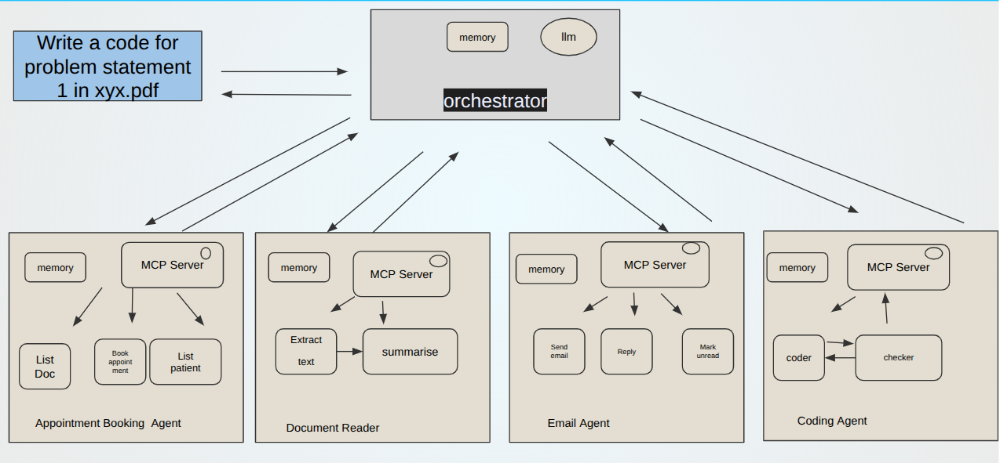
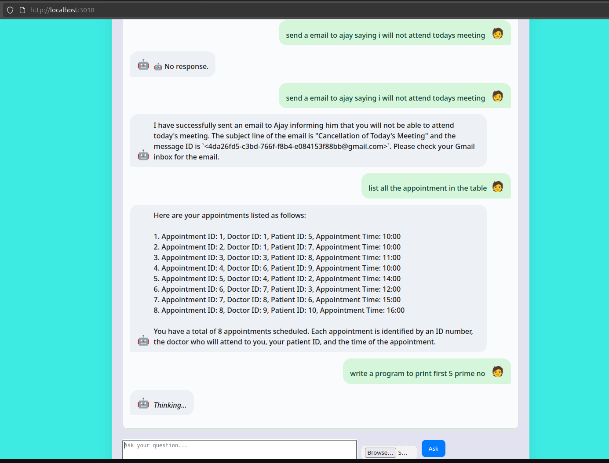
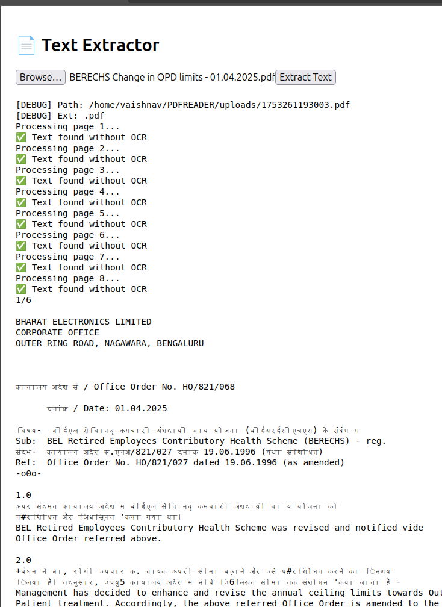

# 🧠 Super AI Router Agent

An intelligent multi-tool AI routing server that processes natural language prompts and dynamically routes them to the most appropriate AI agent or tool (e.g., email, hospital booking, document extraction, code generation) using a smart planner powered by a local LLM (e.g., Mistral via Ollama).

---



## 🛠️ Features

- 🔁 **Dynamic Tool Selection**: Routes pron`, and forwards the request via `handlers.js`. Responses are summarized and returned to the user.

prompts to the best-suited agent using a local LLM.
- 🧠 **Context-Aware Routing**: Maintains short-term memory for conversational context.
- 📨 **Email Agent**: Sends emails based on user prompts.
- 🏥 **Hospital Booking Agent**: Manages hospital appointment bookings.
- 📄 **Document Extraction Agent**: Extracts text from PDFs and DOCX files, with OCR support for scanned documents.
- 💻 **AutoCoder Agent**: Generates and executes Python code (integrates with `autocoder` project).
- 🤖 **LLM Fallback**: Provides direct reon`, and forwards the request via `handlers.js`. Responses are summarized and returned to the user.

 from `tools.json`, and forwards the request via `handlers.js`. Responses are summarized and returned to the user.



---

## 📦 Project Structure

```
super-ai-router/
├── server.js                  # Express server (entry point)
├── handlers.js               # Routes and forwards requests based on planner
├── context.json              # Local memory for recent interactions
├── tools.json                # Declared tools with name and description
├── agents/                   # Individual tool agents
│   ├── email/                # Email agent logic
│   ├── hospital/             # Hospital booking agent logic
│   ├── document/             # Document extraction agent (uses PyMuPDF, pytesseract, etc.)
│   └── coder/                # AutoCoder agent (code generation and execution)
├── assets/                   # Diagrams and images for documentation
└── README.md
```

---

## 🚀 Run Locally

### 1. Clone and Install

```bash
git clone https://github.com/ajay800800/super-ai-agent.git
cd super-ai-agent
```

### 2. Install Dependencies

#### Node.js Dependencies
```bash
npm install
```

#### Python Dependencies (for Document Extraction and AutoCoder Agents)
```bash
pip install flask PyMuPDF pytesseract Pillow python-docx
# Install Tesseract OCR: e.g., `sudo apt install tesseract-ocr` (Ubuntu)
# Install LibreOffice if needed: e.g., `sudo apt install libreoffice` (Ubuntu)
```

#### Local LLM (Mistral via Ollama)
- Install Ollama: Follow instructions at [ollama.ai](https://ollama.ai).
- Pull and run Mistral:
  ```bash
  ollama pull mistral
  ollama run mistral
  ```

### 3. Start the Server

```bash
node server.js
```

- **Runs on**: `http://localhost:4000/super-agent`

### 4. (Optional) Integrate AutoCoder Agent
If using the AutoCoder agent (from the `autocoder` project):
- Copy the `autocoder` folder into `agents/coder/`.
- Ensure the `autocoder` dependencies are installed (see `autocoder` README).
- Start the AutoCoder Flask server:
  ```bash
  cd agents/coder
  python3 runner.py
  ```

---

## 🧪 Example Request

Send a prompt to the server using cURL:

```bash
curl -X POST http://localhost:4000/super-agent \
  -H "Content-Type: application/json" \
  -d '{"prompt": "Send an email to Sumit saying I will be late"}'
```

**Example Response** (for email agent):
```json
{
  "status": "success",
  "tool": "email",
  "message": "Email sent to Sumit with the message: I will be late."
}
```

**Example Prompt for Document Extraction**:
```bash
curl -X POST http://localhost:4000/super-agent \
  -H "Content-Type: application/json" \
  -d '{"prompt": "Extract text from sample.pdf"}'
```

**Example Prompt for Code Generation**:
```bash
curl -X POST http://localhost:4000/super-agent \
  -H "Content-Type: application/json" \
  -d '{"prompt": "Write a Python function to calculate the factorial of a number"}'
```

---


## 🧠 How It Works

1. **Prompt Analysis**: The Express server receives a prompt and sends it to the Mistral LLM (via Ollama) for analysis.
2. **Tool Selection**: The LLM matches the prompt to a tool defined in `tools.json` based on descriptions.
3. **Request Forwarding**: `handlers.js` routes the prompt to the selected agent (e.g., email, document, coder).
4. **Agent Execution**:
   - **Email Agent**: Sends emails via an SMTP client.
   - **Hospital Booking Agent**: Interfaces with a booking API (not implemented here).
   - **Document Extraction Agent**: Uses `PyMuPDF` for PDFs, `pytesseract` and `Pillow` for OCR, `python-docx` for DOCX, and `libreoffice` for other formats.
   - **AutoCoder Agent**: Generates and executes Python code (see `autocoder` project).
5. **Response**: The agent’s output is summarized and returned as JSON.

---

## 🖼️ Frontend (Optional)

Connect the server to a React-based chatbot frontend (e.g., ChatUI) or build your own using `fetch('/super-agent')`. Example frontend setup:
```bash
cd frontend
npm install
npm start
```

---

## 📸 Screenshot


*(Insert a screenshot of the server or frontend UI here if available)*

---

## 💡 Future Enhancements

- Add support for more agents (e.g., calendar scheduling, web scraping).
- Improve context management with a database instead of `context.json`.
- Enhance LLM routing with fine-tuned models for better tool selection.
- Add authentication for secure API access.
- Implement parallel agent execution for complex prompts.

---


```<xaiArtifact artifact_id="a48dee07-36a4-40a1-8d82-3e3963f0f24b" artifact_version_id="4786a3a6-6282-4614-870c-4840d60fb98f" title="README.md" contentType="text/markdown">

# 🧠 Super AI Router Agent

An intelligent multi-tool AI routing server that processes natural language prompts and dynamically routes them to the most appropriate AI agent or tool (e.g., email, hospital booking, document extraction, code generation) using a smart planner powered by a local LLM (e.g., Mistral via Ollama).

---

## 🛠️ Features

- 🔁 **Dynamic Tool Selection**: Routes prompts to the best-suited agent using a local LLM.
- 🧠 **Context-Aware Routing**: Maintains short-term memory for conversational context.
- 📨 **Email Agent**: Sends emails based on user prompts.
- 🏥 **Hospital Booking Agent**: Manages hospital appointment bookings.
- 📄 **Document Extraction Agent**: Extracts text from PDFs and DOCX files, with OCR support for scanned documents.
- 💻 **AutoCoder Agent**: Generates and executes Python code (integrates with `autocoder` project).
- 🤖 **LLM Fallback**: Provides direct responses via the local LLM when no specific tool applies.

---

## ⚙️ Architecture

The system analyzes prompts using a local LLM (Mistral via Ollama), selects the appropriate tool from `tools.json`, and forwards the request via `handlers.js`. Responses are summarized and returned to the user.


---

## 📦 Project Structure

```
super-ai-agent/
├── server.js                  # Express server (entry point)
├── handlers.js               # Routes and forwards requests based on planner
├── context.json              # Local memory for recent interactions
├── tools.json                # Declared tools with name and description
├── agents/                   # Individual tool agents
│   ├── email/                # Email agent logic
│   ├── hospital/             # Hospital booking agent logic
│   ├── document/             # Document extraction agent (uses PyMuPDF, pytesseract, etc.)
│   └── coder/                # AutoCoder agent (code generation and execution)
├── assets/                   # Diagrams and images for documentation
└── README.md
```

---

## 🚀 Run Locally

### 1. Clone and Install

```bash
git clone https://github.com/ajay800800/super-ai-agent.git
cd super-ai-router
```

### 2. Install Dependencies

#### Node.js Dependencies
```bash
npm install
```

#### Python Dependencies (for Document Extraction and AutoCoder Agents)
```bash
pip install flask PyMuPDF pytesseract Pillow python-docx
# Install Tesseract OCR: e.g., `sudo apt install tesseract-ocr` (Ubuntu)
# Install LibreOffice if needed: e.g., `sudo apt install libreoffice` (Ubuntu)
```

#### Local LLM (Mistral via Ollama)
- Install Ollama: Follow instructions at [ollama.ai](https://ollama.ai).
- Pull and run Mistral:
  ```bash
  ollama pull mistral
  ollama run mistral
  ```

### 3. Start the Server

```bash
node server.js
```

- **Runs on**: `http://localhost:4000/super-agent`

### 4. (Optional) Integrate AutoCoder Agent
If using the AutoCoder agent (from the `autocoder` project):
- Copy the `autocoder` folder into `agents/coder/`.
- Ensure the `autocoder` dependencies are installed (see `autocoder` README).
- Start the AutoCoder Flask server:
  ```bash
  cd agents/coder
  python3 runner.py
  ```

---

## 🧪 Example Request

Send a prompt to the server using cURL:

```bash
curl -X POST http://localhost:4000/super-agent \
  -H "Content-Type: application/json" \
  -d '{"prompt": "Send an email to Sumit saying I will be late"}'
```

**Example Response** (for email agent):
```json
{
  "status": "success",
  "tool": "email",
  "message": "Email sent to Sumit with the message: I will be late."
}
```

**Example Prompt for Document Extraction**:
```bash
curl -X POST http://localhost:4000/super-agent \
  -H "Content-Type: application/json" \
  -d '{"prompt": "Extract text from sample.pdf"}'
```

**Example Prompt for Code Generation**:
```bash
curl -X POST http://localhost:4000/super-agent \
  -H "Content-Type: application/json" \
  -d '{"prompt": "Write a Python function to calculate the factorial of a number"}'
```

---

## 🧠 How It Works

1. **Prompt Analysis**: The Express server receives a prompt and sends it to the Mistral LLM (via Ollama) for analysis.
2. **Tool Selection**: The LLM matches the prompt to a tool defined in `tools.json` based on descriptions.
3. **Request Forwarding**: `handlers.js` routes the prompt to the selected agent (e.g., email, document, coder).
4. **Agent Execution**:
   - **Email Agent**: Sends emails via an SMTP client.
   - **Hospital Booking Agent**: Interfaces with a booking API (not implemented here).
   - **Document Extraction Agent**: Uses `PyMuPDF` for PDFs, `pytesseract` and `Pillow` for OCR, `python-docx` for DOCX, and `libreoffice` for other formats.
   - **AutoCoder Agent**: Generates and executes Python code (see `autocoder` project).
5. **Response**: The agent’s output is summarized and returned as JSON.

---

## 🖼️ Frontend (Optional)

Connect the server to a React-based chatbot frontend (e.g., ChatUI) or build your own using `fetch('/super-agent')`. Example frontend setup:
```bash
cd frontend
npm install
npm start
```

---

## 📸 Screenshot

*(Insert a screenshot of the server or frontend UI here if available)*

---

## 💡 Future Enhancements

- Add support for more agents (e.g., calendar scheduling, web scraping).
- Improve context management with a database instead of `context.json`.
- Enhance LLM routing with fine-tuned models for better tool selection.
- Add authentication for secure API access.
- Implement parallel agent execution for complex prompts.

---
